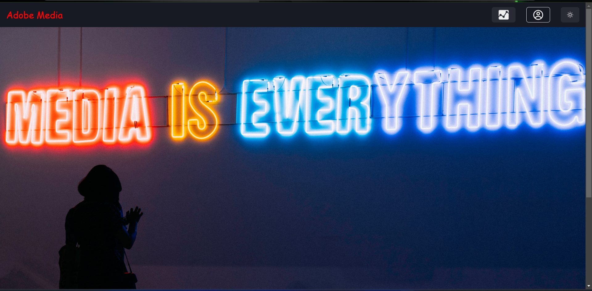
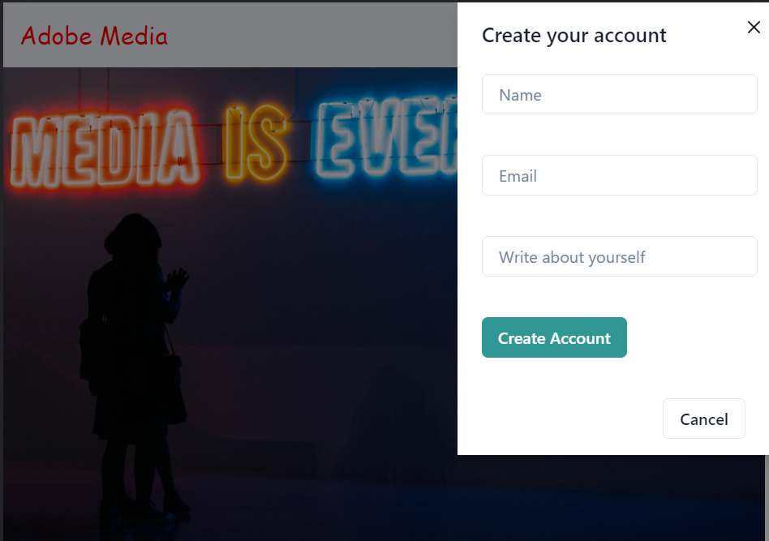
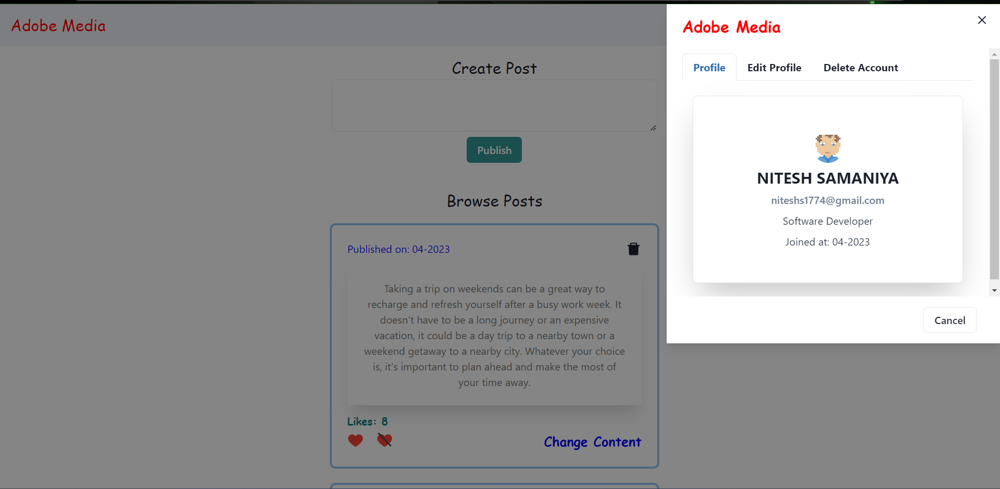
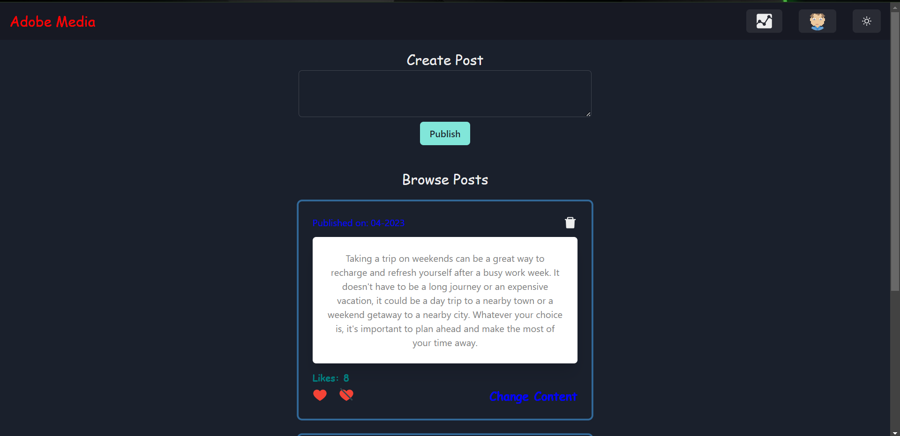
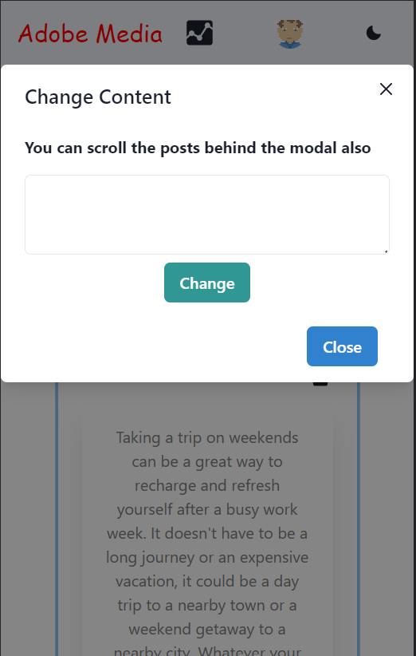

# Adobe Media

#### <a href="https://frontend-murex-xi.vercel.app/">Click to see Live Demo</a>

 

### `About the Assignment`

Adobe Media is a simple social media platform consisting of a backend
API and a frontend UI, and analytics pages. The platform support creating,
reading, updating, and deleting operations for user profiles and posts. In addition,
users should be able to "like" and "unlike" posts. The analytics pages display
insights on user engagement and content popularity.

 
 

### `Screenshots of screen in all three devices`

